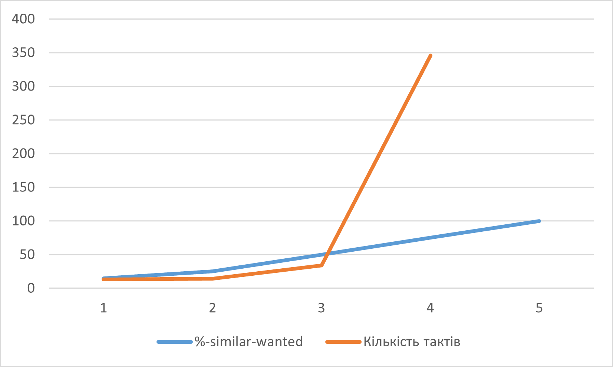
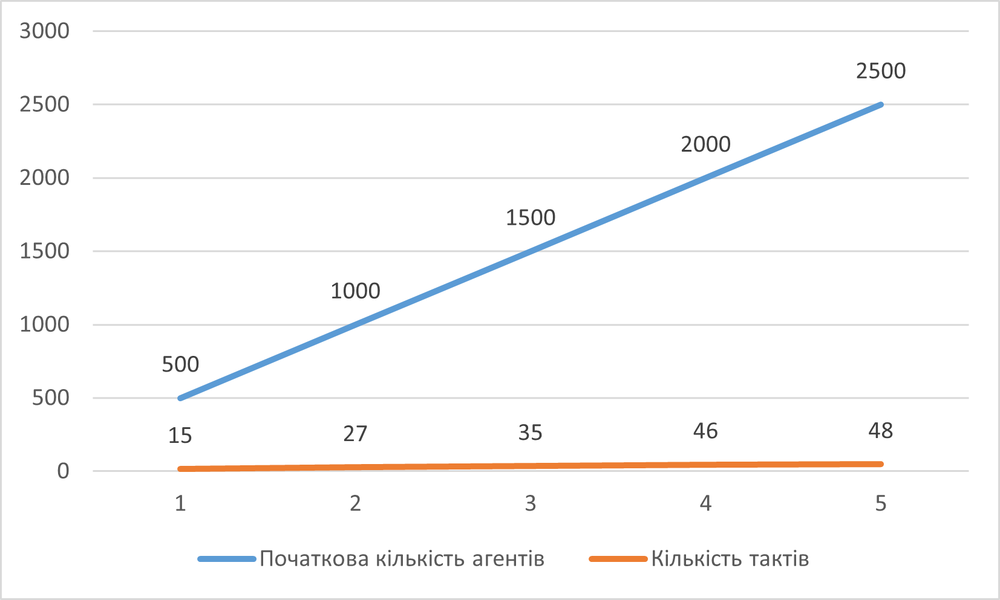

## Комп'ютерні системи імітаційного моделювання
## СПм-23-4, **Іванченко Даниїл Ігорович*
### Лабораторна робота №**1**. Опис імітаційних моделей та проведення обчислювальних експериментів

 

### Варіант 8, модель у середовищі NetLogo:
[Segregation Simple Extension 1](http://www.netlogoweb.org/launch#http://www.netlogoweb.org/assets/modelslib/IABM%20Textbook/chapter%203/Segregation%20Extensions/Segregation%20Simple%20Extension%201.nlogo)

 

### Вербальний опис моделі:
Цей проєкт моделює взаємодію черепах, які належать до різних етнічних груп, у вигаданій водоймі. Усі черепахи підтримують дружні відносини одна з одною, однак кожна прагне жити ближче до представників своєї групи. У межах цієї симуляції аналізується, як індивідуальні уподобання черепах впливають на їх розташування у водоймі, що призводить до формування великомасштабних моделей.

### Керуючі параметри:
- **number** керує загальною кількістю черепах.
- **number-of-ethnicities** контролює кількість різних типів черепах.
- **%-similar-wanted** контролює відсоток своїх, що хоче бачити черепах біля себе.

### Показники роботи системи:
**percent similar** - показує середній відсоток сусідів одного кольору для кожної черепахи. Він починається приблизно з 0,5, оскільки кожна черепаха починає з рівною кількістю червоних і зелених черепах як сусідів (в середньому).
**percent unhappy** - показує відсоток черепах, які мають менше сусідів з однієї етнічної приналежності, ніж вони хочуть.

### Примітки:
- Згодом кількість нещасних черепах зменшується. Але ставок стає більш відокремленим, з кластерами кожної етнічної групи.
- Зазвичай симуляція триває +/- 40 тактів.

### Недоліки моделі:
- Немає проявів агресії та битв.
- Відсутність бажання бачити іншу етнічну групу поблизу.

 

## Обчислювальні експерименти
### 1. Вплив різноманітності черепах на динаміку впорядкування системи.
Досліджується залежність швидкості завершення симуляції від керуючого параметру **number-of-ethnicities**.
Експерименти проводяться при таких керуючих параметрах:
- **number** 2000
- **%-similar-wanted** 30%

<table>
<thead>
<tr><th>Кількість видів</th><th>Кількість тактів</th></tr>
</thead>
<tbody>
<tr><td>2</td><td>11</td></tr>
<tr><td>3</td><td>27</td></tr>
<tr><td>4</td><td>32</td></tr>
<tr><td>5</td><td>38</td></tr>
</tbody>
</table>

Графік наочно показує, що при збільшенні різномманіття типів черепах збільшується і час, необхідний їм для знаходження "свого місця".

### 2. Як відсоток одноколірних черепах, яких кожна черепаха прагне мати у своєму оточенні, впливає на швидкість завершення симуляції.
Досліджується залежність тривалості симуляції від керуючого параметру **%-similar-wanted**.
Експерименти проводяться при таких керуючих параметрах:
- **number-of-ethnicities** 3
- **number** 2000

<table>
<thead>
<tr><th>%-similar-wanted</th><th>Кількість тактів</th></tr>
</thead>
<tbody>
<tr><td>15</td><td>14</td></tr>
<tr><td>25</td><td>15</td></tr>
<tr><td>50</td><td>36</td></tr>
<tr><td>75</td><td>348</td></tr>
<tr><td>100</td><td>Нескінченно</td></tr>
</tbody>
</table>

Графік наочно показує, що при збільшенні необхідного мінімуму однокольорних черепах, що хоче бачити черепах біля себе для того, щоб залишатися на місці та бути щасливою відповідно й збільшується тривалість симуляції.

### 3. Вплив початкової кількості "черепах" на швидкість упорядковування системи.
Досліджується залежність кількості тактів від **number**.
Експерименти проводяться при таких керуючих параметрах:
- **number-of-ethnicities** 3
- **%-similar-wanted** 50%

<table>
<thead>
<tr><th>Початкова кількість агентів</th><th>Кількість тактів</th></tr>
</thead>
<tbody>
<tr><td>500</td><td>15</td></tr>
<tr><td>1000</td><td>27</td></tr>
<tr><td>1500</td><td>35</td></tr>
<tr><td>2000</td><td>46</td></tr>
<tr><td>2500</td><td>48</td></tr>
</tbody>
</table>

